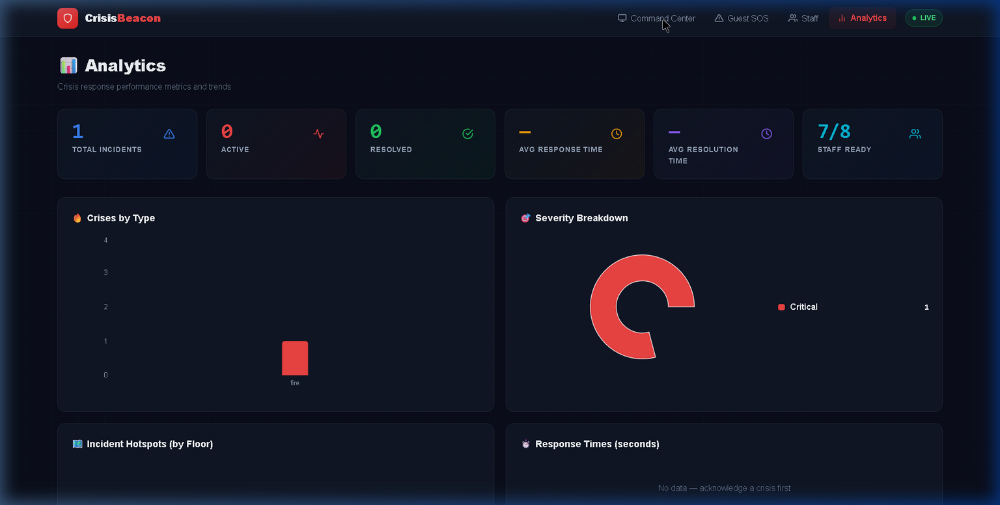
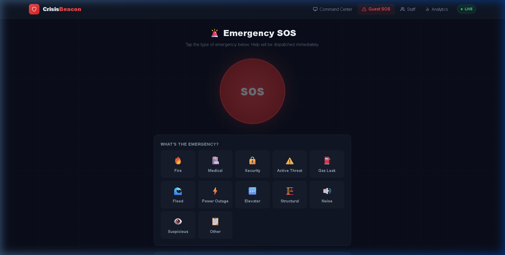
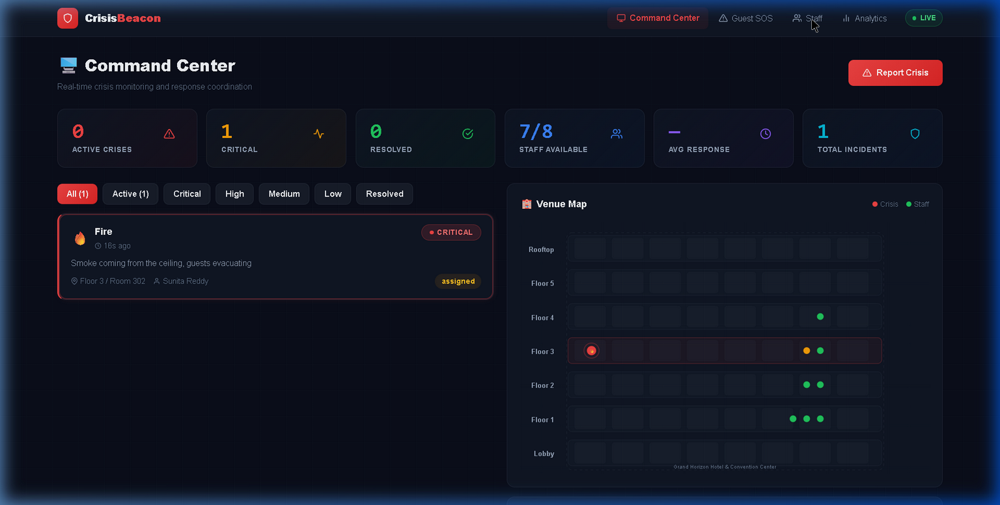
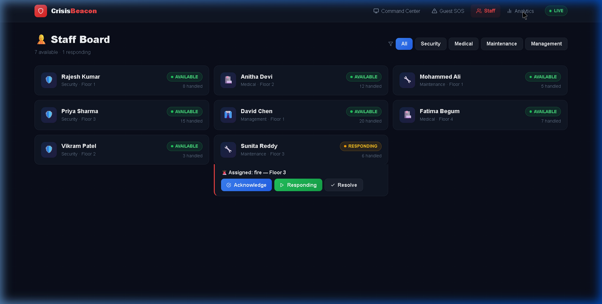

<div align="center">
  
  
  
  

  <h1>🚨 CrisisBeacon</h1>
  <p><b>"When seconds matter, every signal counts."</b></p>
  <p>A real-time crisis detection and response coordination platform for hospitality venues.</p>
</div>

---

## 📖 Overview

CrisisBeacon is an enterprise-grade emergency response platform designed specifically for hotels, campuses, and large venues. It bridges the critical 5-minute gap between an emergency being reported and first responders arriving. By empowering guests to instantly report emergencies via zero-friction QR codes and equipping staff with a real-time Command Center, CrisisBeacon eliminates communication delays over walkie-talkies or phone systems.


## ✨ Key Features

- **⚡ Zero-Friction Reporting:** Guests scan a QR code to instantly access the SOS portal without downloading an app. The location (floor and room) is pre-filled.
- **📡 Sub-Second Real-Time Coordination:** Powered by WebSockets (Socket.io), the Command Center and staff devices are updated within 100ms of an SOS.
- **🧠 Automated Protocol Engine:** Intelligently auto-assigns the best staff member based on role (security, medical, etc.), floor proximity, and experience. Also detects multi-incident clusters.
- **📶 Offline Mesh Recovery Mode:** Resilient Service Worker caching. If a guest loses Wi-Fi while reporting, the app attempts to relay the SOS peer-to-peer via BLE when re-connected.
- **🛡️ Anti-Spam & Rate Limiting:** Built-in IP rate limiting (3 requests/60s) and Geolocation confidence scoring prevent false alarms and malicious bot spam.
- **🔌 PMS Integration Hub:** Webhook-ready to push resolved incident data directly into ALICE, HotSOS, or OPERA PMS as follow-up work orders.

## 🏗️ Architecture

```
CrisisBeacon/
├── backend/                          # Node.js + Express + Socket.io
│   ├── server.js                     # Configures REST + WebSocket
│   ├── store.js                      # In-memory fast database abstraction
│   ├── engine/
│   │   ├── triage.js                 # Smart severity classifier
│   │   └── assignment.js             # Staff auto-assignment logic
│   └── routes/
│       ├── crises.js                 # API endpoints for CRUD + lifecycle
│       └── analytics.js              # Aggregated metrics for dashboard
└── frontend/                         # React 19 + Vite + Tailwind + Framer Motion
    └── src/
        ├── App.jsx                   # PWA Routes + Global Socket connection
        ├── components/               # Animated UI Components
        └── pages/
            ├── CommandCenter.jsx     # Master 7-floor dashboard via Recharts & SVG Map
            ├── GuestSOS.jsx          # Public SOS reporting portal
            ├── StaffView.jsx         # Field operative dispatch screen
            └── Analytics.jsx         # Command Center historical metrics
```

## 📸 Screenshots

### 1. Command Center Dashboard
> The master view featuring live stat cards, a filtered crisis feed, and an interactive 7-floor SVG venue map showing active crises and available staff.



### 2. Guest SOS Portal
> The zero-friction reporting UI. Big touch targets, high contrast, and rapid crisis classification form layout.



### 3. Staff Dispatch Board
> Staff member view displaying active assignments across different roles, allowing instantaneous ACK and resolution.



### 4. Interactive Analytics
> Automatically aggregated metrics showing incident hotspots, response times, and staff leaderboards via Recharts.




## 🚀 Getting Started (Local Development)

To run the application locally, start both the backend server and frontend Vite development server.

### 1. Start Backend (Port 3001)
```bash
cd backend
npm install
npm start
```

### 2. Start Frontend (Port 5173)
```bash
cd frontend
npm install
npm run dev
```
Open `http://localhost:5173` in your browser.

## 🧑‍⚖️ Hackathon Implementation Notes

For hackathon engineering validation, CrisisBeacon implements several production-grade hardening measures:
- **Rate limiting** middleware on `express` endpoints to drop volumetric attacks.
- **Framer Motion** state transitions providing tactile, application-feel UX.
- **Geolocation mapping fallback** logic capturing the location accuracy radius if QR code is bypassed.
- Simulated external webhooks (`/api/crises/:id/escalate`) mapping to realistic Computer-Aided Dispatch payloads.

## 📄 License

This project is licensed under the MIT License - see the [LICENSE](LICENSE) file for details.
