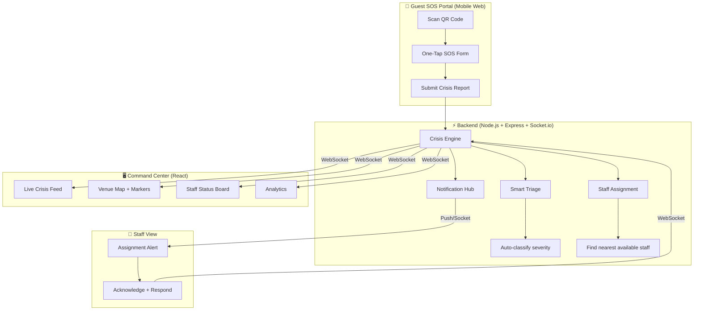

# CrisisBeacon — Implementation Plan

**"When seconds matter, every signal counts."**

A real-time crisis detection and response coordination platform for hospitality venues that bridges the communication gap between distressed guests, on-site staff, and emergency services.

---

## Why This Wins 🏆

| Judge Criteria | How We Nail It |
|---|---|
| **Problem-Solution Fit** | Directly addresses fragmented communication in hospitality crises |
| **Technical Depth** | Real-time WebSockets, smart triage engine, multi-role architecture |
| **Innovation** | QR-to-SOS (zero friction for guests), live venue map, auto-triage |
| **UI/UX Polish** | Dark glassmorphism command center with live animations |
| **Demo-ability** | Can simulate a full crisis → detection → assignment → resolution in 60 seconds |
| **Completeness** | Full loop: Guest reports → Staff assigned → Responder notified → Crisis resolved → Analytics generated |

---

## Architecture



---

## Proposed Features (MVP for Hackathon)

### 1. 🚨 Guest SOS Portal (the "WOW entrance")
- **No app install needed** — guest scans a QR code from their hotel room/menu
- Opens a mobile-optimized SOS page with:
  - One-tap emergency buttons: 🔥 Fire | 🏥 Medical | 🔒 Security | ⚠️ Other
  - Auto-captures room/location from QR code parameters
  - Optional: description, photo, name
  - **Big red SOS button** with pulse animation
- Sends crisis report via WebSocket → instant appearance on command center

### 2. 🖥️ Command Center Dashboard (the demo centerpiece)
- **Live Crisis Feed** — real-time card stream of incoming + active incidents
- **Interactive Venue Map** — SVG floor plan with:
  - Color-coded crisis markers (pulsing red = critical, amber = moderate)
  - Staff position dots (green = available, yellow = responding)
  - Click on marker → see crisis details + assign staff
- **Stats Bar** — Active crises, average response time, staff available, resolved today
- **Crisis Detail Panel** — Full info, timeline of events, assigned staff, resolution status

### 3. 🤖 Smart Triage Engine
- Auto-classifies severity (Critical / High / Medium / Low) based on:
  - Crisis type (fire/medical = auto-critical)
  - Number of reports for same area (cluster detection)
  - Keywords in description ("unconscious", "fire", "weapon")
- Auto-suggests response protocol (e.g., "Evacuate Floor 3", "Dispatch medical team")
- Auto-escalates if no staff acknowledges within 60 seconds

### 4. 👷 Staff Coordination
- Staff roster with roles (Security, Medical, Management, Maintenance)
- **Auto-assignment** — nearest available staff matched by crisis type
- **Acknowledge button** — staff confirms they're responding
- **Resolution flow** — staff marks crisis as "Contained" → "Resolved" with notes
- **Response time tracking** — timestamps for every state change

### 5. 📊 Analytics Dashboard
- Response time distribution (bar chart)
- Crises by type (donut chart)
- Resolution rate
- Staff performance leaderboard
- Heatmap: which areas have the most incidents

### 6. 🔔 Multi-Channel Alerts
- **WebSocket** — instant dashboard updates
- **Browser notifications** — for staff on the web app
- **Sound alerts** — alarm sound on new critical crisis
- *(Optional: Twilio WhatsApp/SMS for first responders if time permits)*

---

## Folder Structure

```
CrisisBeacon/
├── backend/
│   ├── package.json
│   ├── server.js              # Express + Socket.io entry point
│   ├── .env
│   ├── engine/
│   │   ├── triage.js          # Smart triage & severity classifier
│   │   └── assignment.js      # Staff auto-assignment logic
│   ├── routes/
│   │   ├── crises.js          # CRUD for crisis reports
│   │   ├── staff.js           # Staff management
│   │   └── analytics.js       # Aggregated stats
│   ├── store.js               # In-memory data store
│   └── seed.js                # Demo venue + staff data
│
├── frontend/
│   ├── package.json
│   ├── vite.config.js
│   ├── index.html
│   └── src/
│       ├── main.jsx
│       ├── App.jsx             # Router + socket provider
│       ├── index.css           # Design system
│       ├── hooks/
│       │   └── useSocket.js    # Socket.io React hook
│       ├── components/
│       │   ├── Navbar.jsx
│       │   ├── CrisisCard.jsx  # Live crisis card with timeline
│       │   ├── VenueMap.jsx    # SVG floor plan with markers
│       │   ├── StaffBadge.jsx
│       │   ├── StatCard.jsx
│       │   └── SeverityBadge.jsx
│       ├── pages/
│       │   ├── CommandCenter.jsx    # Main dashboard
│       │   ├── GuestSOS.jsx         # Guest emergency form
│       │   ├── StaffView.jsx        # Staff assignments
│       │   ├── CrisisDetail.jsx     # Single crisis timeline
│       │   ├── Analytics.jsx        # Charts + metrics
│       │   └── NotFound.jsx
│       └── services/
│           └── api.js          # REST + socket client
│
├── package.json                # Root: npm run dev
└── README.md
```

---

## Tech Stack

| Layer | Technology | Why |
|-------|-----------|-----|
| Frontend | React 18 + Vite | Fast SPA, HMR |
| Styling | Tailwind CSS 4 | Utility-first |
| Real-time | Socket.io Client | WebSocket for live updates |
| Charts | Recharts | Lightweight React charting |
| Backend | Node.js + Express | REST API |
| Real-time | Socket.io Server | Bidirectional WebSocket |
| Data | In-memory store | Hackathon-fast (no DB setup) |
| Routing | React Router v6 | Client-side navigation |

---

## Demo Flow (60-second pitch)

> [!IMPORTANT]
> This is the exact sequence you'd show judges:

1. **"A guest in Room 302 discovers a fire"** → Open Guest SOS on phone (QR scan)
2. **One tap on 🔥 Fire** → Crisis appears INSTANTLY on the Command Center
3. **Dashboard lights up** → Pulsing red marker on the venue map at Floor 3
4. **Auto-triage** classifies it as "CRITICAL" → alarm sound plays
5. **Auto-assignment** → Nearest security + maintenance staff notified
6. **Staff acknowledges** → Status changes to "Responding" in real-time
7. **Staff resolves** → Crisis marked "Resolved" with notes
8. **Analytics update** → Response time: 47 seconds ✅

---

## User Review Required

> [!IMPORTANT]
> **Where should I build this?** Options:
> 1. New folder on Desktop: `c:\Users\ASHIQ RAHMAN\OneDrive\Desktop\CrisisBeacon\`
> 2. Inside the VolunteerBridge workspace (separate subfolder)

> [!IMPORTANT]
> **Design aesthetic** — I'm going with a **dark command-center theme** (think military ops room / NASA mission control). Deep navy/charcoal background, red/amber urgency colors, glassmorphism panels, pulse animations on active crises. Sound good?

> [!NOTE]
> **No external API keys needed** — Everything runs locally with demo data. Socket.io handles real-time. No Google Maps or Twilio required. This makes the demo 100% reliable on hackathon day.

---

## Verification Plan

### Live Demo Test
1. Open Command Center on laptop (big screen)
2. Open Guest SOS on phone (or separate browser tab)
3. Submit a crisis → verify it appears in real-time on dashboard
4. Assign staff → verify staff view updates
5. Resolve crisis → verify analytics update
6. Time the full cycle — should be under 10 seconds end-to-end

### Edge Cases
- Multiple simultaneous crises
- Staff all busy → escalation message
- Same-area clustering (detects related reports)
